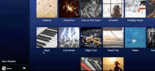
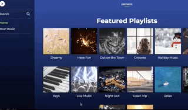
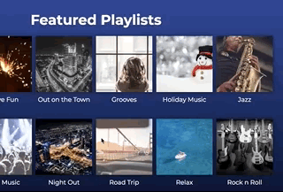
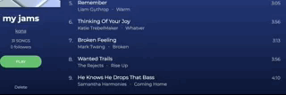
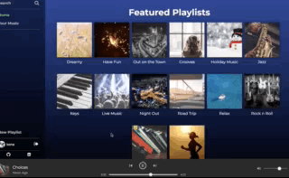
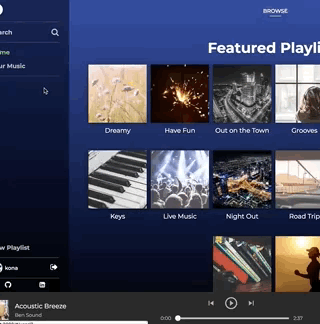

<a href="https://play-this.herokuapp.com/">
    
</a>

# PlayThis

# Table of Contents


- [Introduction](#introduction)
- [Features](#features)
  + [Playlist creation](#playlist-creation)
  + [Browse and follow playlists users](#playlist-browse)
  + [Continuous playback while navigating](#continuous-play)
  + [Play music directly from search](#search-to-play)
- [In the Future](#in-the-future..)

# Introduction

[PlayThis live](https://play-this.herokuapp.com/)

PlayThis is a Spotify inspired full-stack web application. PlayThis is built using a Rails backend, PostgreSQL database, and a React - Redux frontend.
The current version of PlayThis provides a **lite** range of features, including music playback, playlist CRUD, and playlist/user following. Please take a look at some of the implemented features and the potential for growth this application has!

# Features

+ User authentication
  - Backend and frontend user authentication
+ [Playlist creation](#playlist-creation)
+ [Browse and follow playlists users](#playlist-browse)
+ [Continuous playback while navigating](#continuous-play)
+ [Play music directly from search](#search-to-play)

# Playlist creation

Users can create new playlists that are automatically added to their list of playlists.



[Back to Top](#playthis)
# Playlist Browse

Playlists are retrieved from `PlaylistsController` using database queries and divided on PlayThis' playlists, owned playlists, followed playlists, and other public playlists by other users.



### Following Users and Playlists

By updating the users array of followed user IDs or followed playlist IDs in our state, we can make use of the methods automatically added by Rails when a `has_many` association is declared, namely, the `collection_singular_ids=(ids)` method. By making a `PATCH` ajax request with the user and its updated list of followed items, Rails will handle the adding or deleting of appropriate associations.

```
@user = current_user
followed_users = params[:user][:followed_user_ids]
followed_playlists = params[:user][:followed_playlist_ids]
@user.followed_user_ids = followed_users
@user.followed_playlist_ids = followed_playlists
```

The backend then returns the new information to our redux store, which is then passed to our components, triggering a re-render and an immediate update of the follow count of the corresponding playlist or user.

[Back to Top](#playthis)
### Adding and Removing Songs from Playlists

Adding and removing songs from playlists uses the same approach as updating follows.

##### Add songs to playlists:



##### Remove songs from playlists:

  
*whoops, let's not delete that playlist..*

[Back to Top](#playthis)
# Continous Play

What's the point of a music app if every time you navigate to another page the page has to reload? Hence the magic of single page apps!



By dedicating a slice of state to the playback, we can ensure that unless the user chooses to leave the site, music will be uninterrupted during navigation.

```
playback: {
  playbackQueue: [songId1, songId2, ...],
  isPlaying: true
}
```

The playback component as a result will continuously play music so long as there are songs in the `playbackQueue`.

Additional player functionality:
+ Playing the next song after song end or next button clicked
  + If it is the last song in the queue, the playback stops and the playlist resets to the first song of the playlist.
+ Previous button returns to previous song in the queue or restarts the current song, depending on how long the song has been playing. If it is the first song in the queue, nothing changes.

[Back to Top](#playthis)
# Search to Play

There are many ways to play music. Users can click on the play button that appears when hovering over a playlist image on the browse page. This triggers all the songs in that playlist to be queued up and played.

Similarly, the user can click into the playlist itself, click the play button or the same play button hovered over the playlist image to begin playing that playlist.

If interested in only one song, the user can double click on a song item itself or click on the play button to the left of the song title to play a single song.

An added benefit of the single song play implementation is playing single songs directly from the search results.



Search results are generated with database requests when the user types into the search bar.

By reimplementing the same song components in the song results, each song result can then be immediately played in the results page via the aforementioned methods.

### Debounce

Querying the database on every keystroke is not only unscalable, it can also cause issues with the displayed results. Since the queries are asynchronous, there's no guarantee that the latest results displayed are in sync with the latest search query.

To avoid querying the database an excessive amount of times and to aid in proper search results, a `lodash` method `_.debounce` is used. This method waits a defined amount of time before executing the callback passed into it - in this case, the database query.

```
document.getElementById('search-query').addEventListener('keyup', _.debounce(this.handleSearch, 500));
```

[Back to Top](#playthis)
# In the Future..

+ Authenticate sign up email addresses
+ Implement more responsive web design
+ Show recently played music on navigation bar
+ Retain history of user's last played for uninterrupted use between sessions
+ User feed to receive notification of followed users' activity
+ Loop playlist or song
+ Shuffle playlist
+ Click to edit owned playlist name
+ Song listen counts
+ Item priority by popularity
  + Most followed/listened to artists/albums/playlists/songs/users show up first in search
  + Discover section features the popular public playlists

[Back to Top](#playthis)
